# Azure Active Directory Home Lab

## Project Overview
This project demonstrates the deployment and configuration of an Active Directory Domain Services (AD DS) environment in Microsoft Azure. The lab includes creating a Windows Server virtual machine, promoting the server to a Domain Controller, creating Organizational Units (OUs), managing users, and implementing Group Policy security settings.

This lab was built to strengthen hands-on skills in:
- Active Directory Administration
- Group Policy Management
- Windows Server Administration
- Azure Virtual Machines
- User and Organizational Unit Management
- Security Policy Configuration

---

# Lab Environment

| Component | Details |
|---|---|
| Cloud Platform | Microsoft Azure |
| Operating System | Windows Server 2025 Datacenter |
| Domain Name | lab.local |
| Tools Used | Active Directory Users and Computers, Group Policy Management |
| VM Name | testVM |

---

# Step 1 - Create Azure Virtual Machine

A Windows Server 2025 virtual machine was created in Microsoft Azure to host the Active Directory environment.

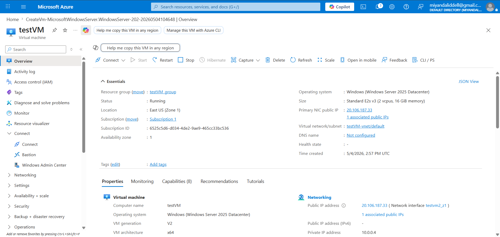

---

# Step 2 - Connect to the Virtual Machine

Remote Desktop Protocol (RDP) was used to securely connect to the Windows Server virtual machine.

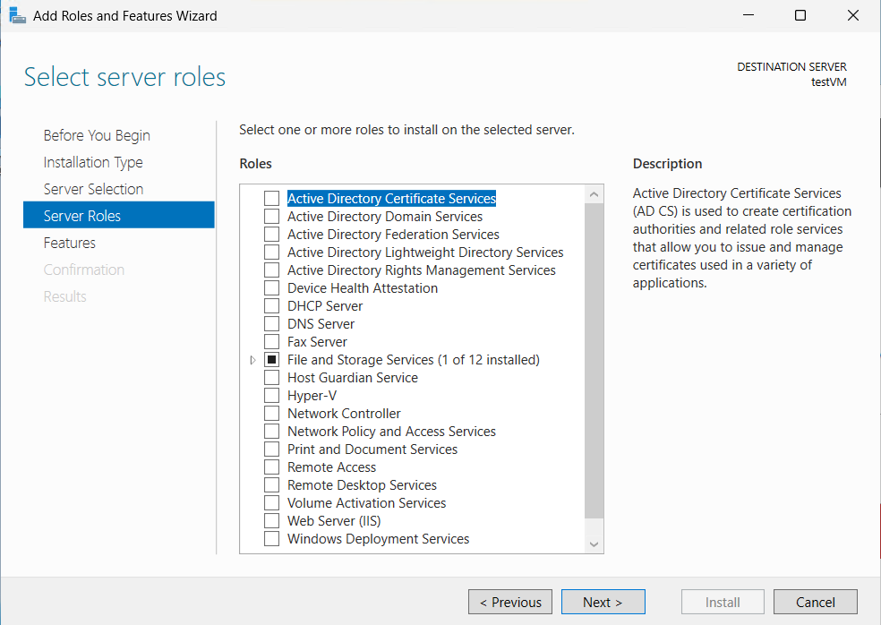

---

# Step 3 - Open Server Manager

After connecting to the server, Server Manager was used to begin configuring Active Directory services.

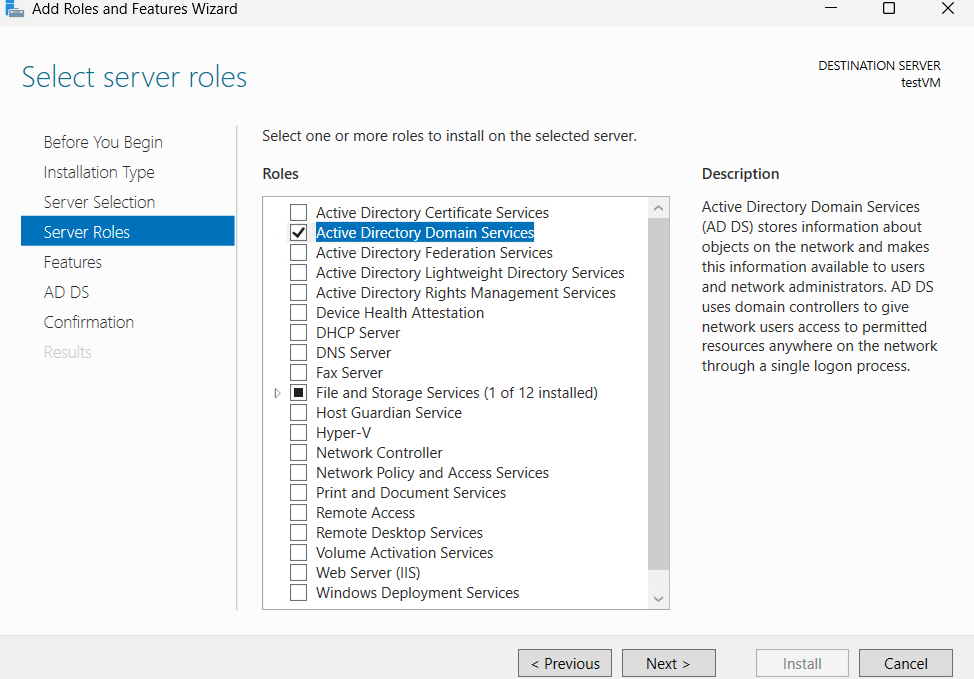

---

# Step 4 - Install Active Directory Domain Services (AD DS)

The Active Directory Domain Services role was selected and installed through the Add Roles and Features Wizard.

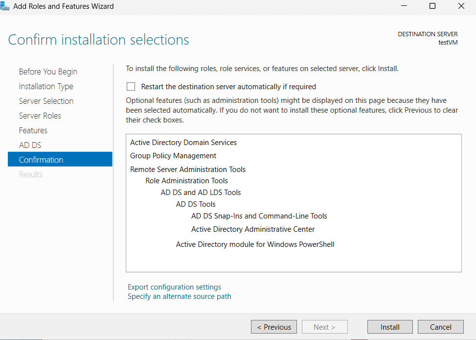

---

# Step 5 - Confirm Installation Settings

The AD DS installation settings and required management tools were confirmed before deployment.

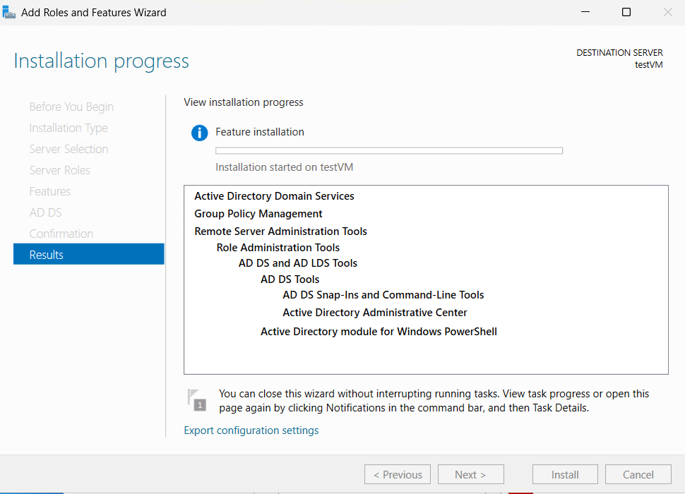

---
# Step 6 - AD DS Installation Progress

The installation process completed successfully and installed the required Active Directory services and management tools.

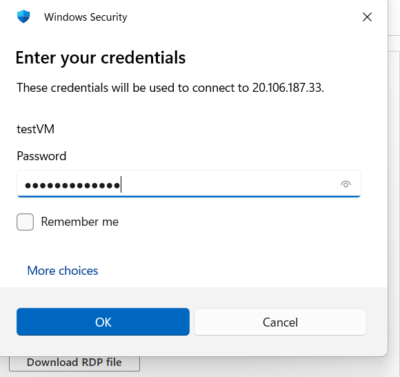

---

# Step 7 - Promote Server to Domain Controller

The server was promoted to a Domain Controller using the Active Directory Domain Services Configuration Wizard.

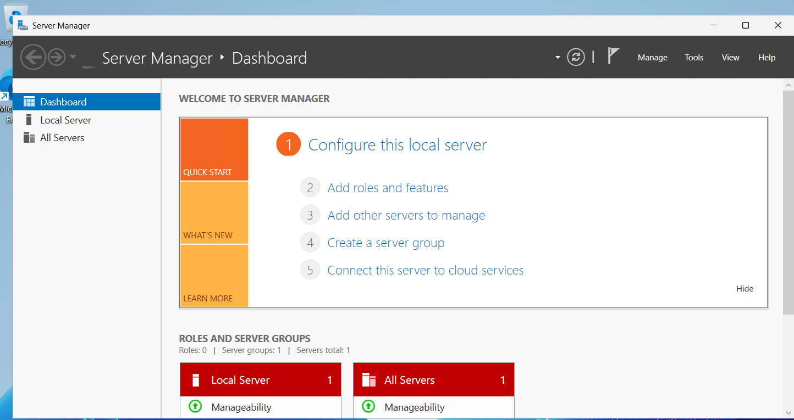

---

# Step 8 - Configure New Forest

A new Active Directory forest named lab.local was created.

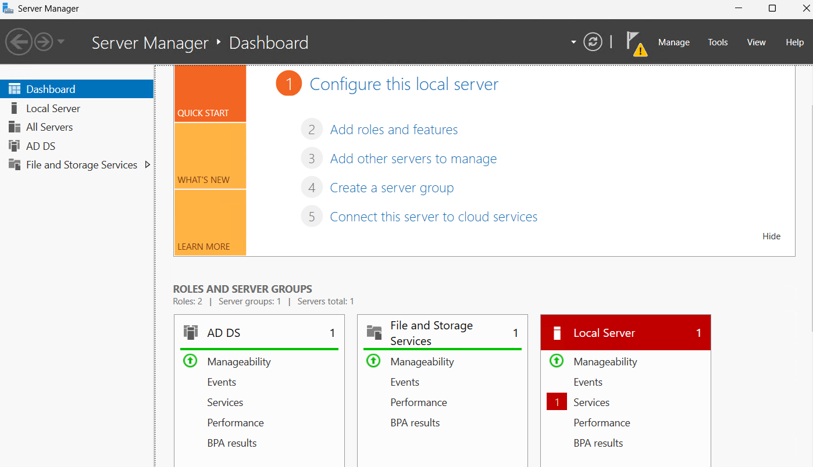

---

# Step 9 - Verify AD DS Deployment

The AD DS role and services were successfully installed and visible in Server Manager.

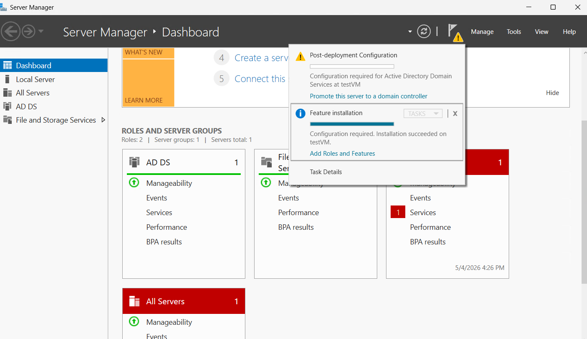

---

# Step 10 - Open Active Directory Administrative Tools

Administrative tools such as Active Directory Users and Computers were launched to begin managing the domain environment.

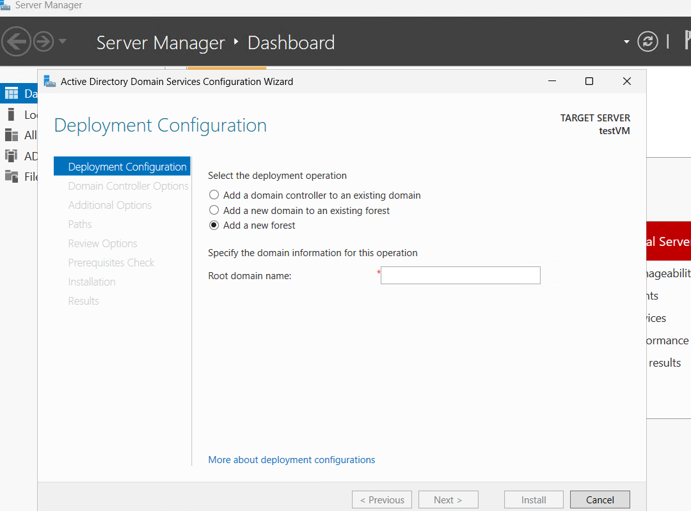

---

# Step 11 - Create Organizational Units (OUs)

Organizational Units were created to organize users and systems by department.

Examples:
- HR
- Finance
- IT
- Sales
- Workstations

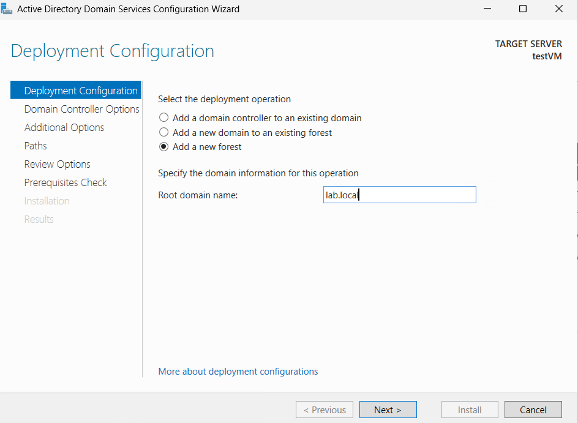

---

# Step 12 - Verify Organizational Units

The Organizational Units were successfully created and displayed within Active Directory Users and Computers.

---
Add Active Directory deployment steps

# Step 13 - Create Active Directory User

A new user account was created in Active Directory Users and Computers.

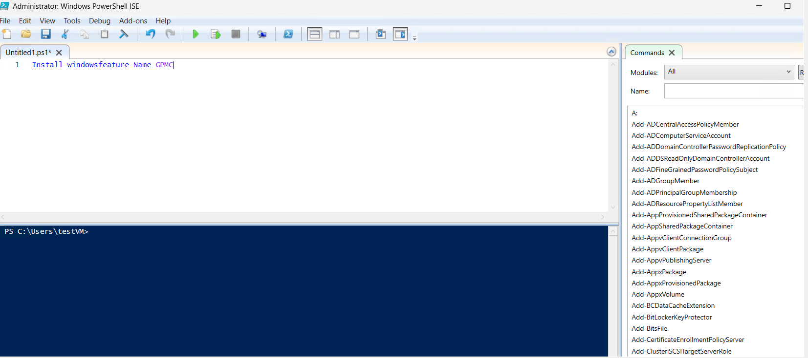

---

# Step 14 - Open Group Policy Management

Group Policy Management was opened to manage domain and organizational unit policies.

---

# Step 15 - Verify Domain in Group Policy Management

The lab.local domain was visible in Group Policy Management with testVM listed as the domain controller.

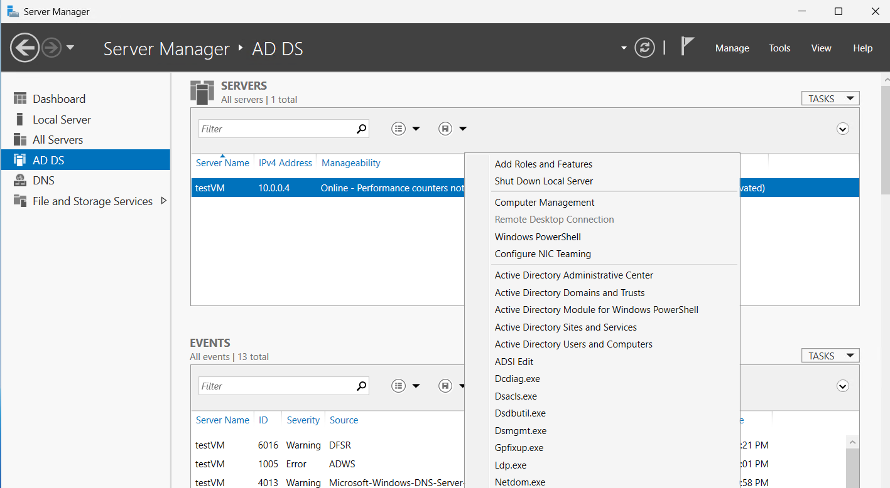

---

# Step 16 - Create and Link IT Security Policy

A new Group Policy Object named IT Security Policy was created and linked to the IT Organizational Unit.

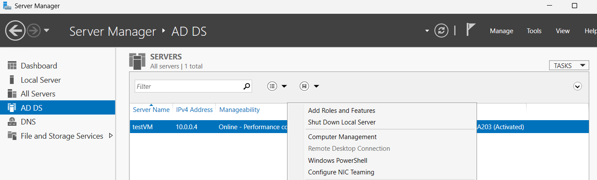

---

# Step 17 - Verify IT Security Policy Link

The IT Security Policy GPO was successfully linked and enabled for the IT Organizational Unit.

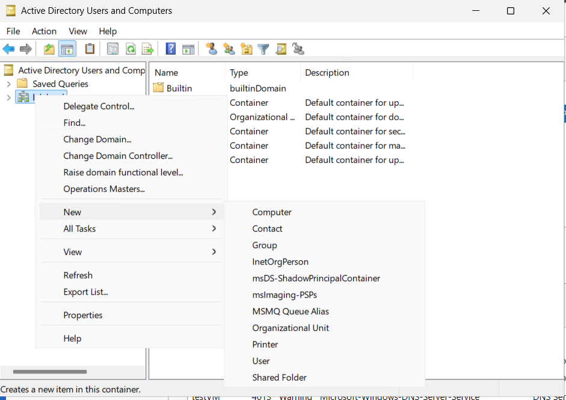

---

# Step 18 - Configure Password Policy

The Group Policy Management Editor was used to access password policy settings.

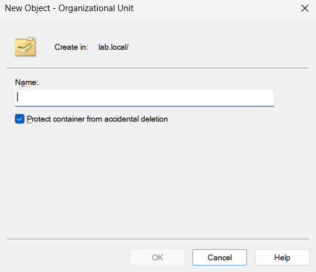

---

# Step 19 - Enable Password Complexity

Password complexity requirements were enabled to strengthen account security.

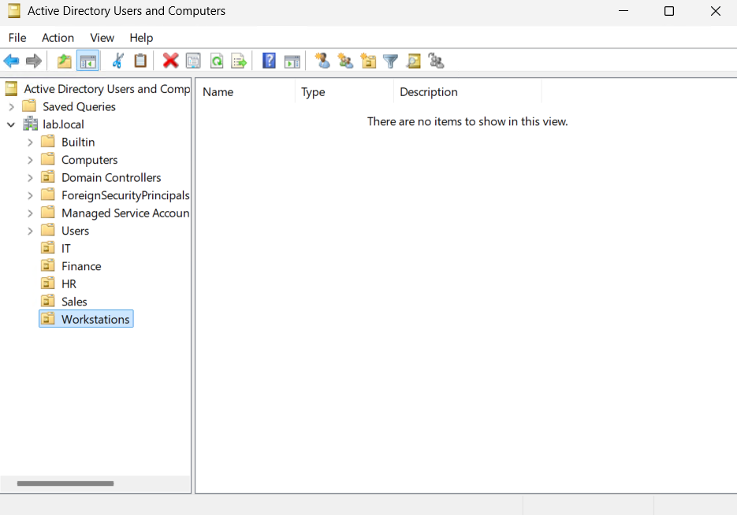

---

# Step 20 - Configure Machine Inactivity Lock

A machine inactivity limit was configured to automatically lock the system after 900 seconds.

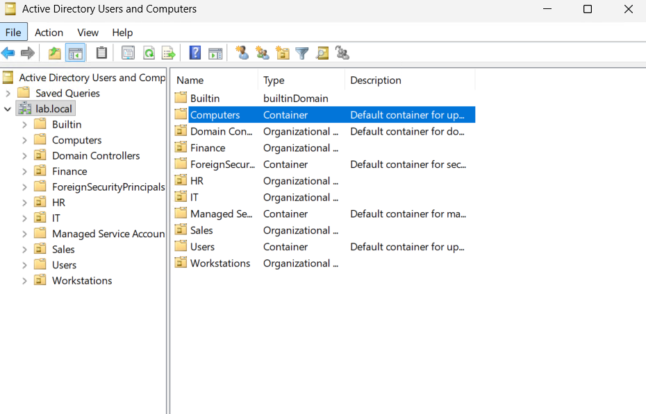

---

# Key Takeaways

This lab helped demonstrate hands-on experience with:

- Deploying a Windows Server virtual machine in Microsoft Azure
- Installing Active Directory Domain Services
- Promoting a server to a Domain Controller
- Creating and organizing Active Directory Organizational Units
- Creating and managing user accounts
- Creating and linking Group Policy Objects
- Configuring password and workstation security policies

---

# Skills Demonstrated

- Microsoft Azure
- Windows Server Administration
- Active Directory Domain Services
- Active Directory Users and Computers
- Group Policy Management
- User Account Management
- Organizational Unit Management
- Security Policy Configuration
- Basic Identity and Access Management
