# Azure Active Directory Home Lab

## Project Overview

This project demonstrates the deployment and configuration of an Active Directory Domain Services (AD DS) environment in Microsoft Azure. The lab includes creating a Windows Server virtual machine, promoting the server to a Domain Controller, creating Organizational Units (OUs), managing users, and implementing Group Policy security settings.

This lab was built to strengthen hands-on skills in:

- Active Directory Administration
- Group Policy Management
- Windows Server Administration
- Azure Virtual Machines
- User and Organizational Unit Management
- Security Policy Configuration

---

## 🔧 Lab Environment

| Component | Details |
|---|---|
| **Cloud Platform** | Microsoft Azure |
| **Operating System** | Windows Server 2025 Datacenter |
| **Domain Name** | lab.local |
| **Tools Used** | Active Directory Users and Computers, Group Policy Management |
| **VM Name** | testVM |
| **VM Public IP** | 20.106.187.33 |
| **Private IP** | 10.0.0.4 |
| **Domain Controller FQDN** | testVM.lab.local |
| **DC Type** | Global Catalog (GC) — Read/Write |
| **FSMO Roles Held** | SchemaMaster, DomainNamingMaster, PDCEmulator, RIDMaster, InfrastructureMaster |
| **Domain Users Created** | alice.chen, bob.patel, carol.jones, david.smith |

---

## 📋 Lab Walkthrough

---

### Phase 1 — Azure VM Provisioning

#### Step 1 — VM Provisioned in Microsoft Azure

The `testVM` virtual machine was provisioned in the Azure Portal running **Windows Server 2025 Datacenter**. The VM overview confirms the full configuration: Gen V2, x64, East US Zone 1, public IP `20.106.187.33`, private IP `10.0.0.4`, and Agent Status: **Ready**. This is the starting point — a fresh cloud VM with no roles and no domain configured.

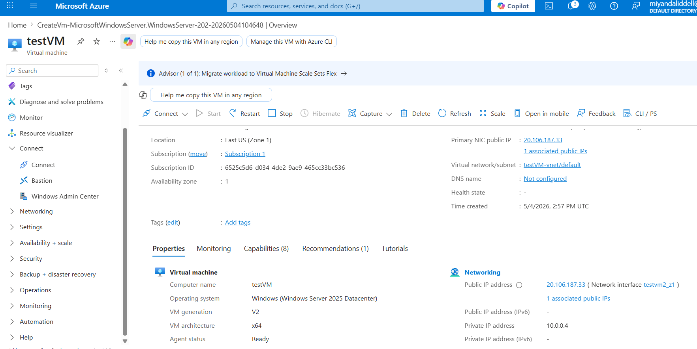

---

#### Step 2 — Connecting via Native RDP

The Azure Portal's native RDP connection pane was used to configure and initiate the connection. The source IP, destination public IP (`20.106.187.33`), and port `3389` were confirmed. NSG inbound rules were verified before connecting.

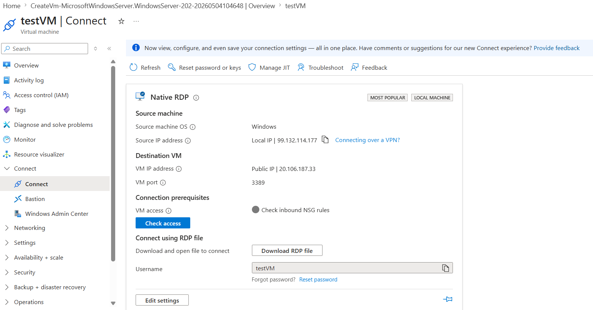

> **Troubleshooting note:** Initial authentication failed due to incorrect credential formatting (`MIMIE\testVM` vs. the correct local format `testVM`). Azure VM local accounts do not use a domain prefix until the machine is domain-joined. An untrusted RDP certificate warning was also navigated — expected in environments without a CA-signed certificate.

---

### Phase 2 — AD DS Role Installation & DC Promotion

#### Step 3 — Selecting and Installing the AD DS Role

Inside **Server Manager → Add Roles and Features**, `Active Directory Domain Services` was selected. The wizard automatically bundled all required dependencies: Group Policy Management, Remote Server Administration Tools, AD DS Snap-ins, Active Directory Administrative Center, and the AD module for Windows PowerShell.

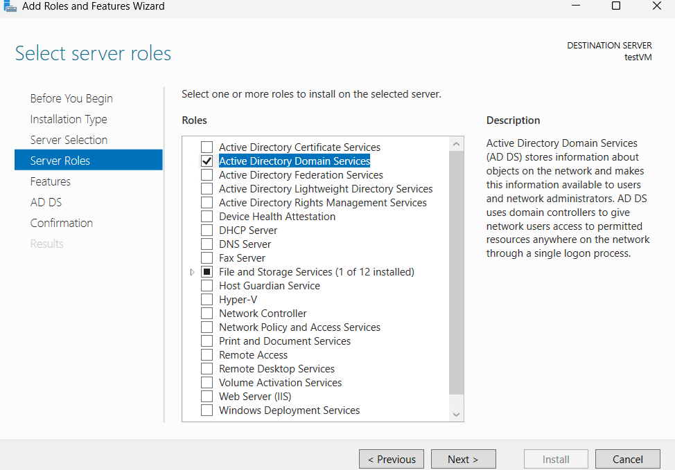

---

#### Step 4 — Domain Controller Promotion Complete

After promoting the server via the AD DS Configuration Wizard (`Add a new forest` → root domain `lab.local`), Server Manager confirmed **3 active roles**: `AD DS`, `DNS`, and `File and Storage Services` — all reporting healthy Manageability status. The domain `lab.local` was live.

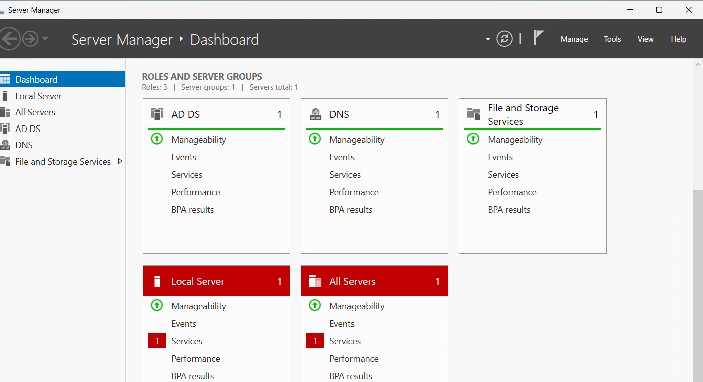

---

### Phase 3 — Active Directory Structure & User Administration

#### Step 5 — Organizational Unit Design

Organizational Units were created under `lab.local` to mirror a realistic enterprise department structure: **Finance**, **HR**, **IT**, **Sales**, and **Workstations** — each protected against accidental deletion.

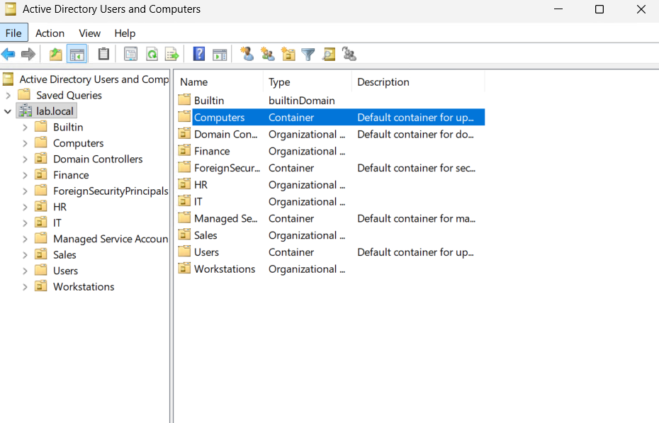

---

#### Step 6 — Domain Controller Verified as Global Catalog

The **Domain Controllers** OU confirmed `testVM` is registered as a **Global Catalog (GC)** server at `Default-First-Site`, verifying the DC promotion completed correctly at the AD object level.

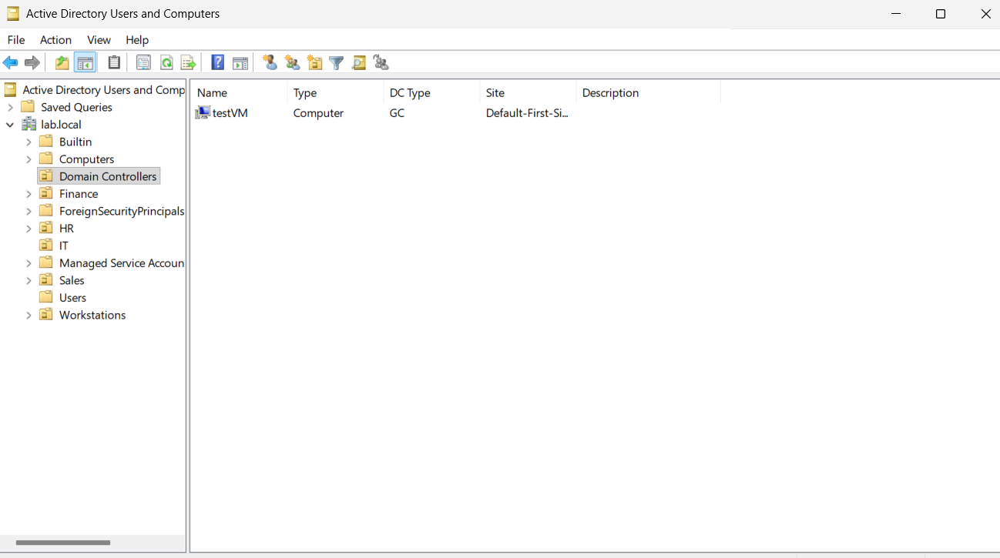

---

### Phase 4 — Group Policy Object Configuration

#### Step 7 — IT Security Policy Created and Linked

A GPO named **"IT Security Policy"** was created and linked to the **IT** Organizational Unit. GPMC confirmed `Link Order: 1`, `Link Enabled: Yes`, `GPO Status: Enabled` — fully active and applying to all IT OU members.

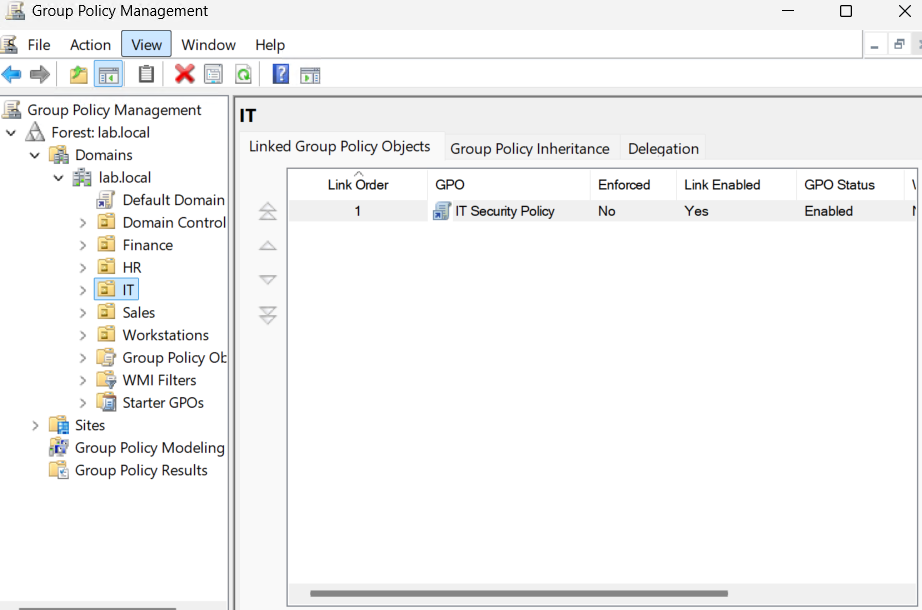

---

#### Step 8 — Security Setting: Removable Storage Blocked

All removable storage classes (USB drives, external media) were denied for IT OU members. This policy takes precedence over any individual removable storage class settings and prevents unauthorized data exfiltration.

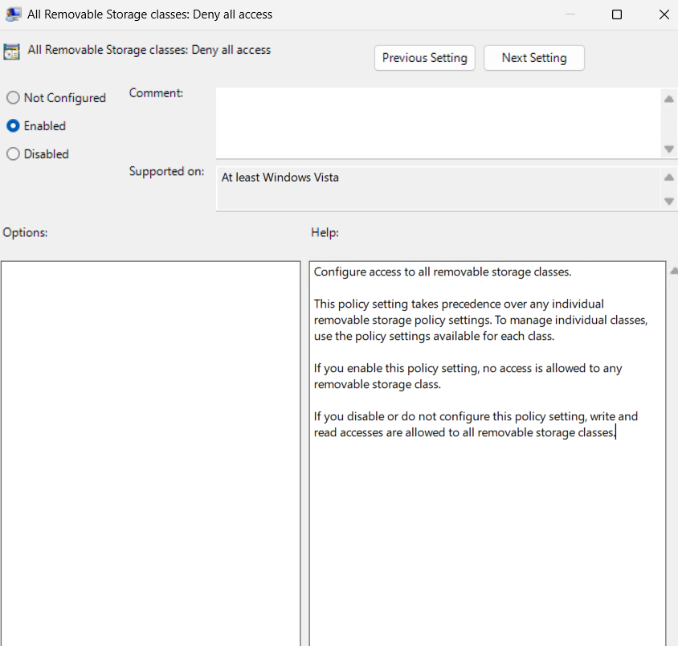

---

#### Step 9 — Security Setting: Machine Inactivity Lock

The `Interactive logon: Machine inactivity limit` was set to **900 seconds (15 minutes)**, automatically locking idle workstations to prevent unauthorized physical access — a CIS Benchmark Level 1 control.

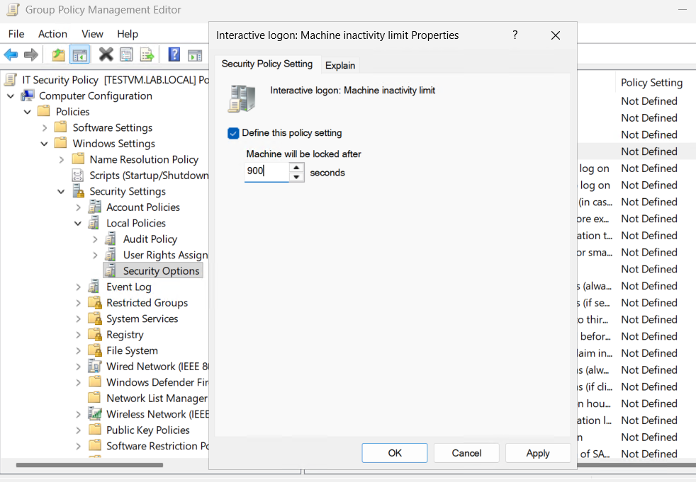

---

#### Step 10 — Security Setting: Password Complexity Enforced

Password complexity requirements were enabled under `Account Policies → Password Policy`, requiring all IT OU users to set passwords that meet Windows complexity rules (uppercase, lowercase, numbers, symbols).

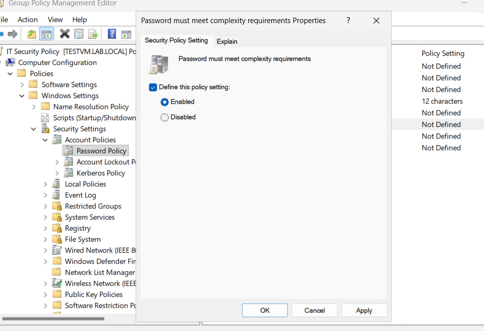

---

### Phase 5 — Advanced PowerShell AD Administration

#### Step 11 — Account Management via PowerShell

A full suite of AD account operations was performed via PowerShell — password reset with forced change at next logon, unlocking a locked-out account, disabling a terminated user, and auditing accounts inactive for 90+ days.

```powershell
Set-ADAccountPassword -Identity "bob.patel" -Reset `
  -NewPassword (ConvertTo-SecureString "NewPass@2026!" -AsPlainText -Force)
Set-ADUser -Identity "bob.patel" -ChangePasswordAtLogon $true
Unlock-ADAccount -Identity "carol.jones"
Disable-ADAccount -Identity "david.smith"

$cutoff = (Get-Date).AddDays(-90)
Get-ADUser -Filter {LastLogonDate -lt $cutoff -and Enabled -eq $true} `
  -Properties LastLogonDate | Select-Object Name, LastLogonDate
```

---

#### Step 12 — Group Membership Updated and Verified

`alice.chen` was added to the `IT_Admins` security group. The before/after `Get-ADPrincipalGroupMembership` output confirms the change: membership grew from `Domain Users` only to `Domain Users` + `IT_Admins`.

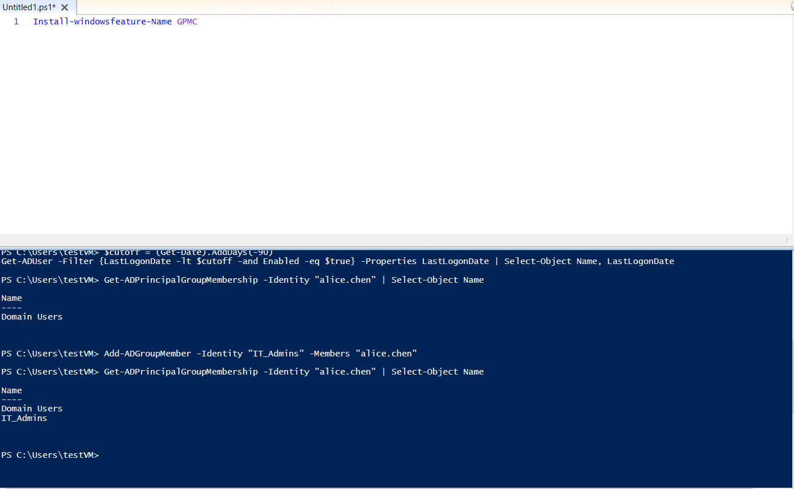

---

#### Step 13 — IT_Admins Group Membership Confirmed

`Get-ADGroupMember -Identity IT_Admins` confirmed alice.chen as the sole member of the group, displaying her full Distinguished Name, ObjectGUID, SamAccountName, and SID.

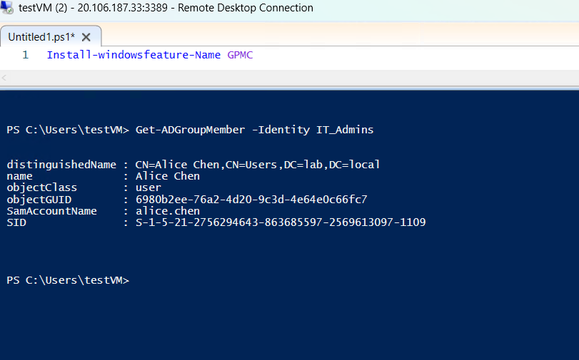

---

### Phase 6 — Final Verification

#### Step 14 — Full Domain User Inventory

`Get-ADUser -Filter *` returned the complete user inventory of `lab.local`, displaying full AD properties for every account.

| User | UPN | Status |
|---|---|---|
| testVM | — | Enabled |
| Alice Chen | alice.chen@lab.local | Enabled |
| Bob Patel | bob.patel@lab.local | Enabled |
| Carol Jones | carol.jones@lab.local | Enabled |

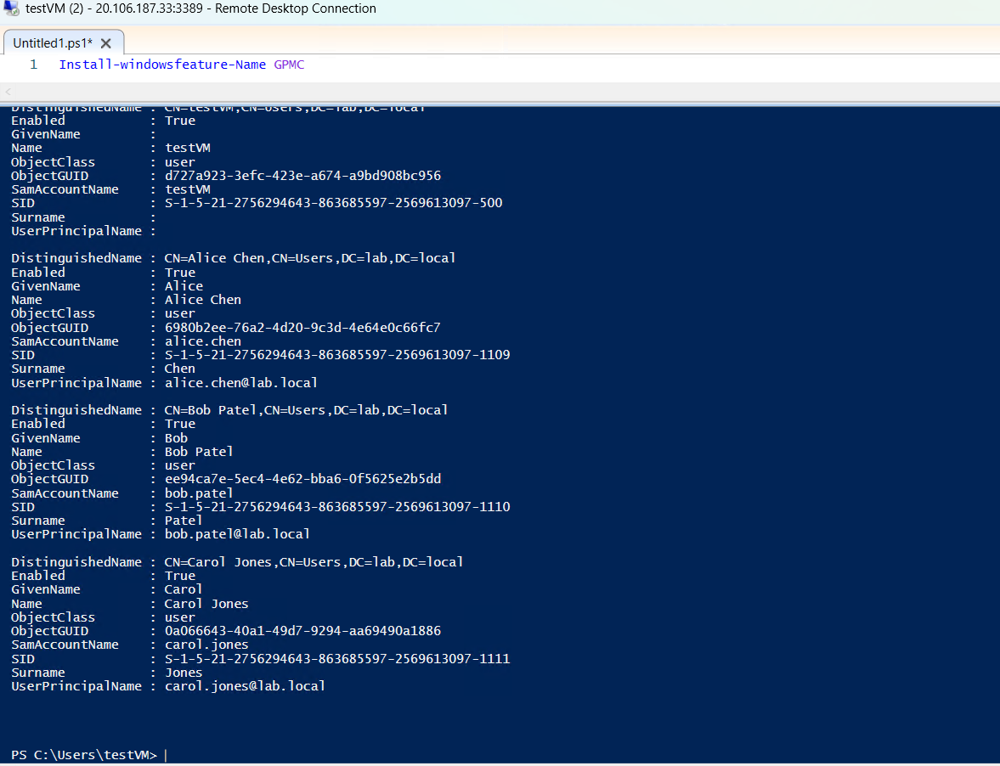

---

#### Step 15 — DC Properties & FSMO Roles Confirmed

`Get-ADDomainController` returned full DC metadata confirming `testVM.lab.local` holds all five FSMO roles, is a Global Catalog, and runs Windows Server 2025 Datacenter.

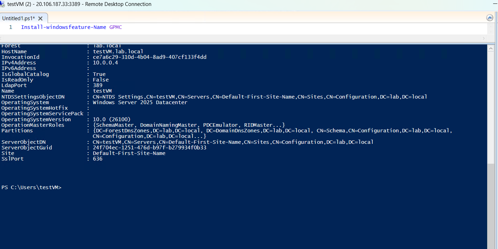

---

#### Step 16 — GPO Inheritance Verified

`Get-GPInheritance` confirmed the IT OU receives both the directly linked **IT Security Policy** and the domain-wide **Default Domain Policy** through normal inheritance.

```powershell
Get-GPInheritance -Target "OU=IT,DC=lab,DC=local"
```

| Property | Value |
|---|---|
| GpoLinks | {IT Security Policy} |
| InheritedGpoLinks | {IT Security Policy, Default Domain Policy} |

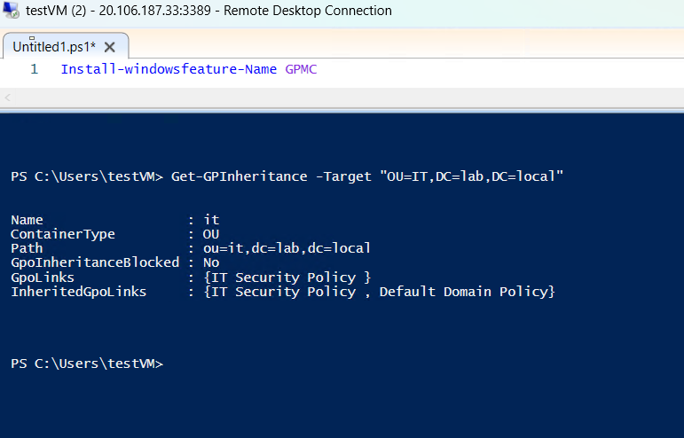

---

## ✅ Key Takeaways

This lab helped demonstrate hands-on experience with:

- Deploying and configuring a Windows Server VM in Microsoft Azure
- Installing and promoting Active Directory Domain Services
- Designing an OU structure and managing domain user accounts
- Creating and configuring Group Policy Objects for security compliance
- Administering Active Directory via PowerShell

---

## 🛠️ Skills Demonstrated

- Microsoft Azure
- Windows Server Administration
- Active Directory Domain Services (AD DS)
- Group Policy Management
- PowerShell Scripting
- Identity and Access Management (IAM)
- Security Policy Configuration
- DNS Configuration

---

## 💻 PowerShell Commands Reference

```powershell
# ── Feature Management ───────────────────────────────────────────
Install-WindowsFeature -Name GPMC

# ── User Account Operations ──────────────────────────────────────
Set-ADAccountPassword -Identity "bob.patel" -Reset `
  -NewPassword (ConvertTo-SecureString "NewPass@2026!" -AsPlainText -Force)
Set-ADUser -Identity "bob.patel" -ChangePasswordAtLogon $true
Unlock-ADAccount -Identity "carol.jones"
Disable-ADAccount -Identity "david.smith"

# ── Audit & Reporting ────────────────────────────────────────────
$cutoff = (Get-Date).AddDays(-90)
Get-ADUser -Filter {LastLogonDate -lt $cutoff -and Enabled -eq $true} `
  -Properties LastLogonDate | Select-Object Name, LastLogonDate
Get-ADUser -Filter * -Properties *

# ── Group Membership ─────────────────────────────────────────────
Get-ADPrincipalGroupMembership -Identity "alice.chen" | Select-Object Name
Add-ADGroupMember -Identity "IT_Admins" -Members "alice.chen"
Get-ADGroupMember -Identity IT_Admins

# ── Infrastructure Queries ───────────────────────────────────────
Get-ADDomainController
Get-ADOrganizationalUnit -Filter * -Properties LinkedGroupPolicyObjects
Get-GPInheritance -Target "OU=IT,DC=lab,DC=local"
```

---

## 🔗 Related Technologies

`Microsoft Azure` · `Windows Server 2025` · `Active Directory` · `DNS` · `Group Policy` · `RDP` · `PowerShell` · `ADUC` · `GPMC` · `Domain Controller` · `Global Catalog` · `FSMO Roles` · `LDAP` · `SID` · `NSG` · `CIS Benchmarks` · `NIST SP 800-63`
